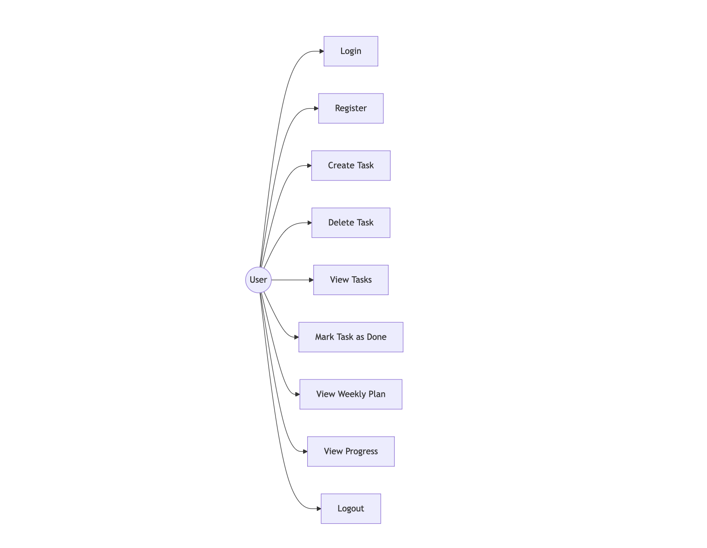
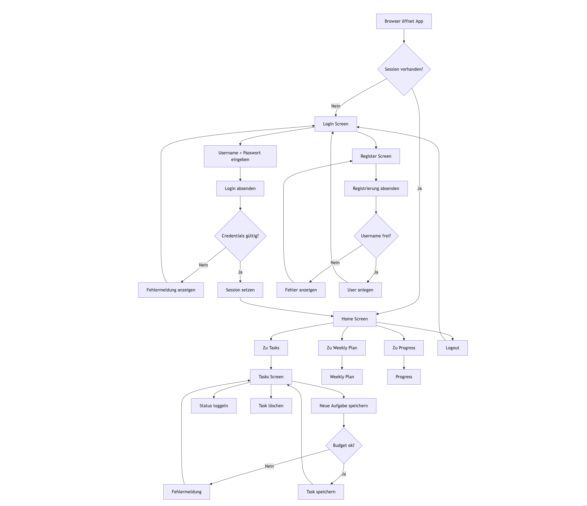

# Data Model & Use Case Diagramme – TaskScore

Diese Seite dokumentiert die fachlichen Abläufe und das Datenmodell der Anwendung
TaskScore anhand von Diagrammen.

---

## 1. Use Case Model

Das Use Case Model zeigt die Interaktion zwischen Nutzer und System sowie
die zentralen Funktionen der Anwendung.

---

## 2. Use Case Flow

Der Use Case Flow beschreibt den typischen Ablauf der Nutzung der Anwendung
vom Login bis zur Fortschrittsauswertung.

