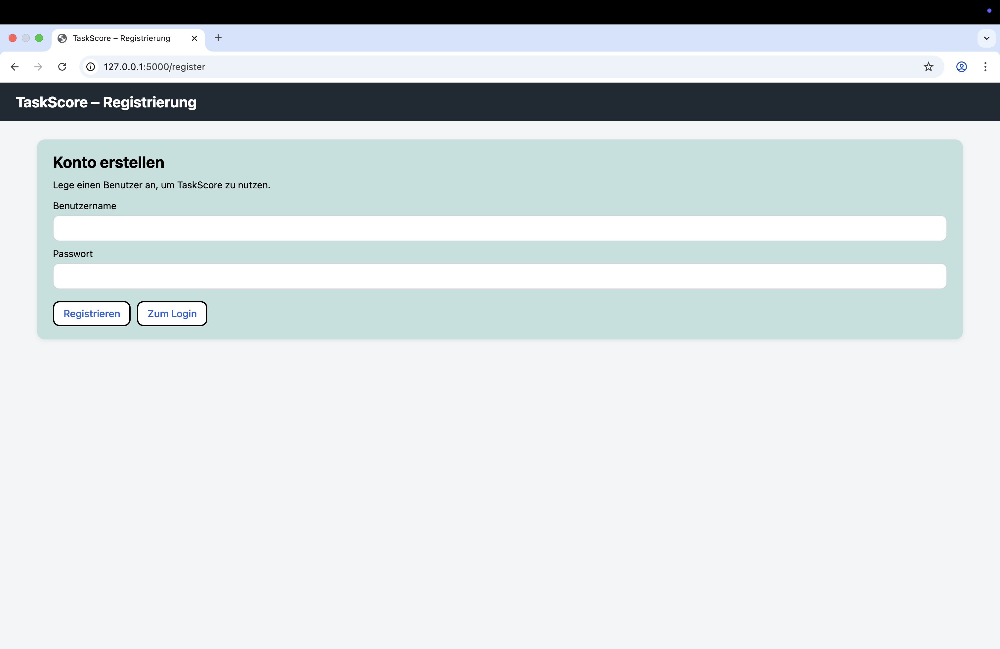
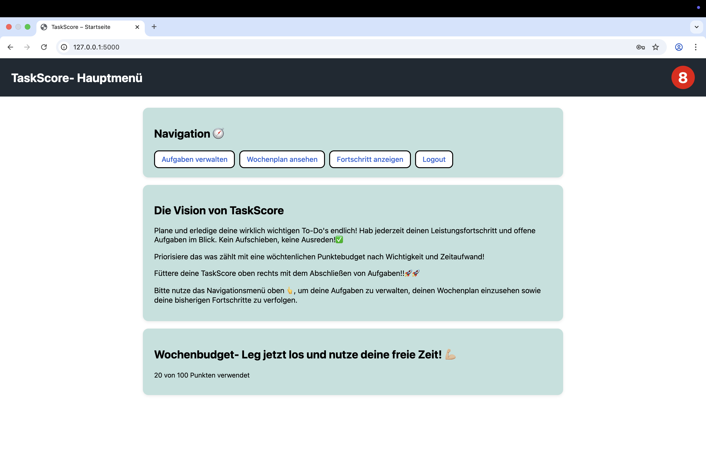
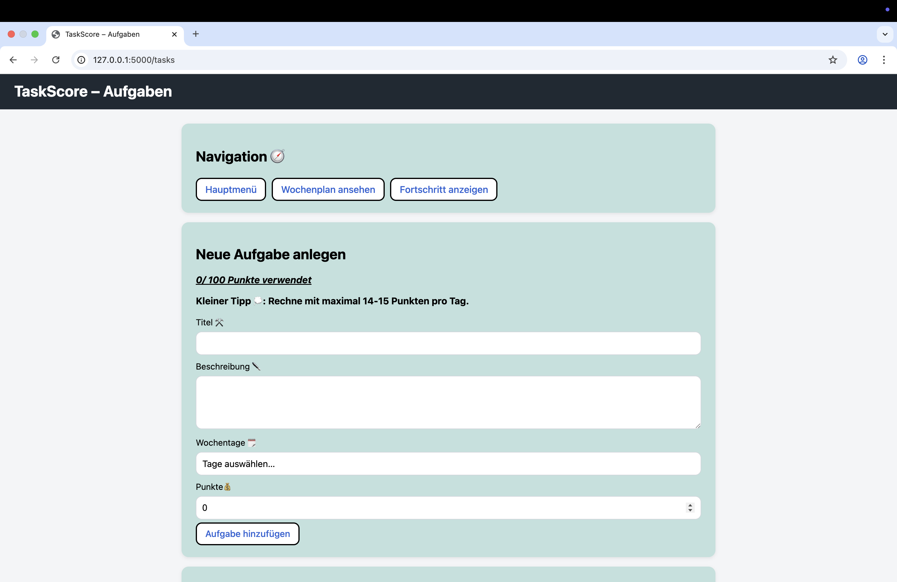
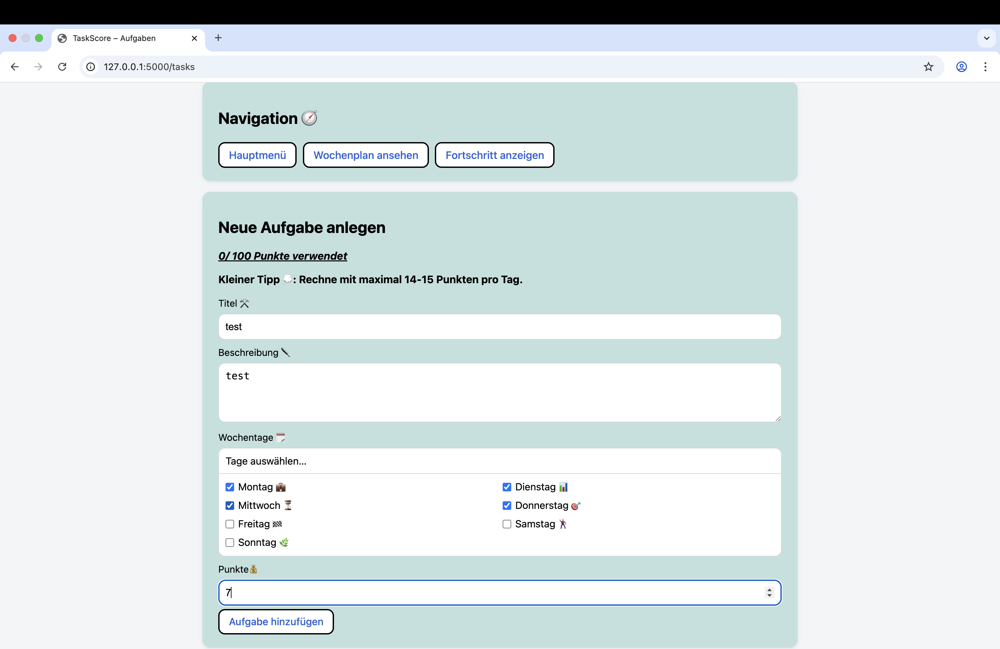
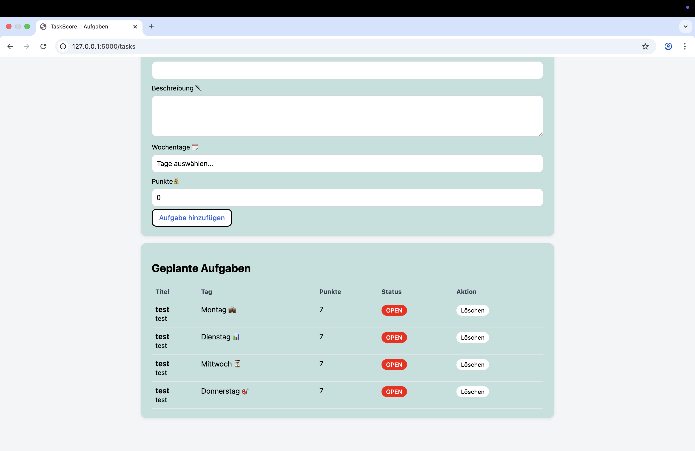
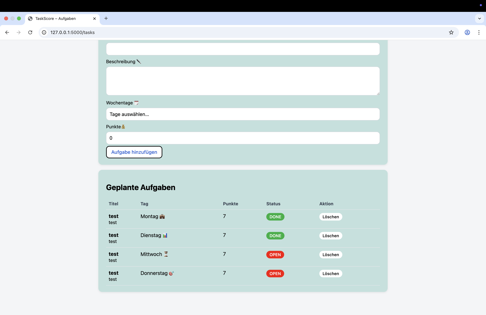
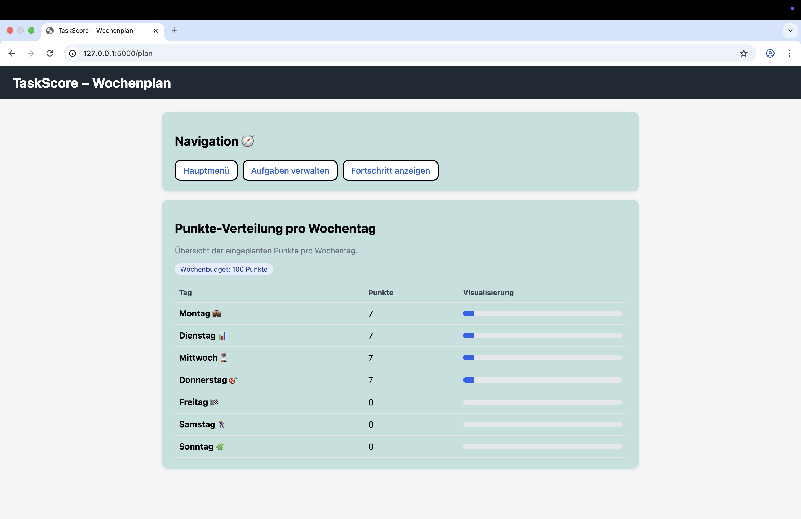
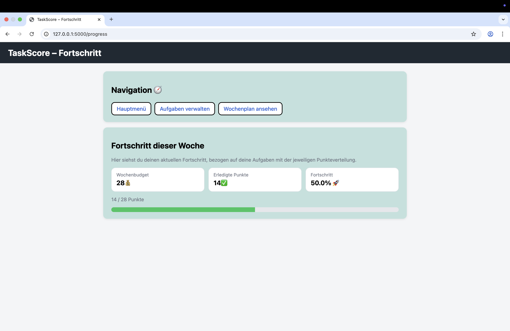

# Screenshots – Übersicht der Anwendung

Diese Seite zeigt die wichtigsten Screens der Anwendung in der vorgesehenen Reihenfolge.  
Unter jedem Screenshot kann nachvollzogen werden, welche Dateien/Funktionen im Code dafür verantwortlich sind.

---

## 1) Login

**Code-Zuordnung**
- Template: `templates/login.html`
- Route (app.py): `GET /login` und `POST /login` → `login()`
- Navigation/Weiterleitung:
  - Erfolgreicher Login: `redirect(url_for("start"))`
  - Link zu Registrierung: `/register`
- DB (database.py):
  - `verify_user(username, password)` (prüft Credentials, liefert `user_id` oder `None`)
- Session:
  - setzt `session["user_id"] = user_id` bei Erfolg
- Template-Variablen (Jinja):

  - `error`


---

## 2) Register

**Code-Zuordnung**
- Template: `templates/register.html`
- Route (app.py): `GET /register` und `POST /register` → `register()`
- Navigation/Weiterleitung:
  - Nach erfolgreicher Registrierung: `redirect(url_for("login"))`
  - Link zurück zum Login: `/login`
- DB (database.py):
  - `create_user(username, password)` (legt User an, gibt `(ok, msg)` zurück)
- Template-Variablen (Jinja):

  - `error`


---

## 3) Hauptmenü

**Code-Zuordnung**
- Template: `templates/home.html`
- Route (app.py): `GET /` → `start()`
- Zugriffsschutz:
  - prüft Login über `login_required()` (Session muss `user_id` enthalten)
  - sonst: `redirect(url_for("login"))`
- DB (database.py):
  - `get_total_points(uid)` (Summe der geplanten Wochenpunkte)
  - `get_user_done_score(uid)` (Punktescore oben rechts, +1 pro erstmalig erledigter Aufgabe)
- Template-Variablen (Jinja):

  - `current_total`
  - `budget` (aus `BUDGET = 100`)
  - `done_score`

- Links im Template:
  - `/tasks`, `/plan`, `/progress`, `/logout`

---

## 4) Tasks-Übersicht

**Code-Zuordnung**
- Template: `templates/tasks.html`
- Route (app.py): `GET /tasks` und `POST /tasks` → `show_tasks()`
- Zugriffsschutz:
  - `login_required()` sonst Redirect zu `/login`
- DB (database.py):
  - `get_all_tasks(uid)` (lädt Aufgabenliste für Tabelle)
  - `get_total_points(uid)` (aktueller Wochenverbrauch)
  - `insert_task(title, description, day, points, uid)` (legt Aufgaben an)
- Budget-Logik (app.py):
  - `BUDGET = 100`
  - prüft: `total + (points * len(weekdays)) <= BUDGET`
  - Fehlertext bei Überschreitung: `Wochenbudget überschritten (...)`
- Template-Variablen (Jinja):

  - `tasks`
  - `current_total`
  - `budget`
  - `error`


---

## 5) Tasks anlegen

**Code-Zuordnung**
- Template: `templates/tasks.html` (Formularbereich „Neue Aufgabe anlegen“)
- Route (app.py): `POST /tasks` → `show_tasks()` (Form action zeigt auf `/tasks`)
- Formularfelder (Template → app.py):
  - `title` → `request.form["title"]`
  - `description` → `request.form.get("description")`
  - `points_total` → `int(request.form.get("points_total") or 0)`
  - `weekdays` (Checkbox-Liste) → `request.form.getlist("weekdays")`
- DB (database.py):
  - `insert_task(...)` wird pro ausgewähltem Wochentag 1x ausgeführt
- Fehlerfälle:
  - kein Wochentag → `error = "Bitte mindestens einen Wochentag auswählen."`
  - Budget überschritten → `error = f"Wochenbudget überschritten (...)"`

---

## 6) Tasks – angelegte Aufgaben

**Code-Zuordnung**
- Template: `templates/tasks.html` (Tabellenbereich „Geplante Aufgaben“)
- Route (app.py): `GET /tasks` → `show_tasks()` (liefert `tasks` an Template)
- DB (database.py):
  - `get_all_tasks(uid)` liefert Liste von Tasks (id, title, description, weekday, points_total, status)
  - Sortierung nach Wochentag erfolgt in SQL via `CASE weekday ...`
- Template-Variablen (Jinja):

  - `tasks` (wird in `` gerendert)
  - Zugriff auf Felder: `t.title`, `t.description`, `t.weekday`, `t.points_total`, `t.status`, `t.id`


---

## 7) Tasks-Status

**Code-Zuordnung**
- Template: `templates/tasks.html` (Status-Button in der Tabelle)
- Route (app.py): `POST /tasks/<int:task_id>/toggle` → `toggle_task(task_id)`
- DB (database.py):
  - `toggle_task_status(task_id, user_id)`
    - schaltet `status` zwischen `OPEN` und `DONE`
    - setzt `rewarded = 1` beim ersten DONE
    - erhöht `user_stats.done_score` nur beim ersten DONE (Belohnungslogik)
- UI-Logik (Template):
  - Button-Klasse hängt von `t.status` ab:
    - `DONE` → grün (`status-done`)
    - sonst → rot (`status-open`)

---

## 8) Wochenplan

**Code-Zuordnung**
- Template: `templates/plan.html`
- Route (app.py): `GET /plan` → `weekly_plan()`
- Zugriffsschutz:
  - `login_required()` sonst Redirect zu `/login`
- DB (database.py):
  - `get_weekly_points(user_id)`
    - gruppiert Tasks nach `weekday`
    - liefert Dictionary: `{ "Montag 💼": 12, ... }`
- Template-Variablen (Jinja):

  - `weekly_points`

- Darstellung:

  - Schleife: ``
  - Balkenbreite: `style="width: {{ points }}%;"`


---

## 9) Fortschritt

**Code-Zuordnung**
- Template: `templates/progress.html`
- Route (app.py): `GET /progress` → `progress()`
- Zugriffsschutz:
  - `login_required()` sonst Redirect zu `/login`
- DB (database.py):
  - `get_total_points(uid)` → `total_points`
  - `get_done_points(uid)` → `done_points` (SUM(points_total) WHERE status='DONE')
- Template-Variablen (Jinja):

  - `total_points`
  - `done_points`

- Berechnung im Template:
  - `percent = (done_points / total_points * 100)` nur wenn `total_points > 0`

  - Progress-Bar: `style="width: {{ percent }}%;"`
